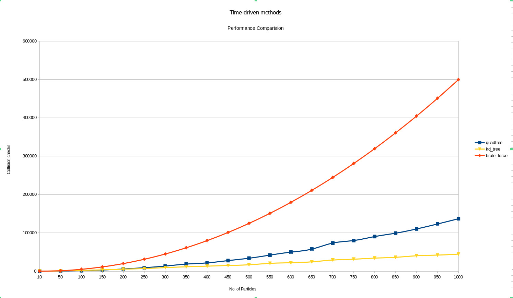

# DSA-II-Project N-Particle Simulation

## We implemented four algorithms for the simulation

### Method 1: Brute force

### Method 2: Quad trees

### Method 3: KD trees

### Method 4: Event driven - Priority queues

### Result:

